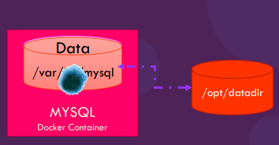

## Docker

### Install Docker
#### Install Docker: Windows
Use the following URL and download the installation file:
https://hub.docker.com/editions/community/docker-ce-desktop-windows

#### Install Docker: Linux
Use the following URL and download the installation file:
https://hub.docker.com/editions/community/docker-ce-desktop-windows

#### Install Docker: Mac
Use the following URL and download the installation file:
https://hub.docker.com/editions/community/docker-ce-desktop-windows

##### Commands

  $ docker version // docker version

  
ps – list containers

``` ps – list containers
  docker ps
  docker ps -a
```
 Stop container
```
  docker stop [name of container]
```
Remove a container
```
docker rm [name of container]
```

List images
```
docker images
```
Remove images
```
docker rmi nginx   ///! Delete all dependent containers to remove image
```

Download image
```
docker run nginx
```
```
docker pull nginx
```
#### Exec – execute a command
```
docker exec <<name of image>> cat /etc/hosts

```
##### Run – attach and detach
```
docker run kodekloud/simple-webapp
```
```
docker run –d kodekloud/simple-webapp
```
##### Run – tag
```
docker run redis:4.0 TAG
```
```
docker run –i kodekloud/simple-prompt-docker
```
 


#### Run volume mapping
```
docker run –v /opt/datadir:/var/lib/mysql mysql
```


##### Inspect container
```
docker inspect <<container name>>
```
##### Container's log
```
docker logs <<container name>>
```
##### Environment variable
```
docker run -e APP_COLOR=blue simple-webapp-color
```

`
Dockerfile
```
FROM Ubuntu   #OS - Ubuntu
RUN apt-get update  #Update apt repo
RUN apt-get install python    #Install dependencies using apt
RUN pip install flask      #Install Python dependencies using pip
RUN pip install flask-mysql
COPY . /opt/source-code     #Copy source code to /opt folder
ENTRYPOINT FLASK_APP=/opt/source-code/app.py flask run  #Run the web server using “flask” command
```
```
docker build Dockerfile –t mmumshad/my-custom-app
docker push mmumshad/my-custom-app D 
```

#### List volumns
docker list volumne
docker rm [volumne]

#### Docker Networking
Docker provides different network settings for Linux and Windows.

For Linux, there are six pre-configured network options:

1. Bridge
2. Host
3. Overlay
4. IPvLan
5. MACvLan
6. None

For Windows, there are six pre-configured network options:

1. NAT (Network Address Translation)
2. Transparent
3. Overlay
4. L2Bridge
5. L2Tunnel
6. None
You choose which of these network configurations to apply to your container depending on its network requirements.


## Kubernetes

https://github.com/zealvora/certified-kubernetes-application-developer


##### Kubectl
*kubectl*, allows you to run commands against Kubernetes clusters.
 Install kubectl
 https://kubernetes.io/docs/tasks/tools/

##### KIND

##### Minikube
https://minikube.sigs.k8s.io/docs/start/

Lets you run Kubernetes locally
```
minikube start
minikube start --vm-driver hyperv --hyperv-virtual-switch "Default Switch" 
kubectl get nodes 
```
Open minikube dashboard `minikube dashboard`

## Kubernetes on AWS
### EKS ( Elastic Kubernets Service)
### Install KubeCtl

Reference: https://docs.aws.amazon.com/eks/latest/userguide/install-kubectl.html


#### Primary scalar types

* Create Cluster
```
eksctl create cluster --name=eksdemo1 --region=us-east-1 --zones=us-east-1a,us-east-1b --without-nodegroup 
```

* Get List of clusters
```
eksctl get cluster 
```  


* Step-02: Create & Associate IAM OIDC Provider for our EKS Cluster
To enable and use AWS IAM roles for Kubernetes service accounts on our EKS cluster, we must create & associate OIDC identity provider.
To do so using eksctl we can use the below command.
Use latest eksctl version (as on today the latest version is 0.21.0)

**Template**
```
eksctl utils associate-iam-oidc-provider \
    --region region-code \
    --cluster <cluter-name> \
    --approve
```

 Replace with region & cluster name
 ```
eksctl utils associate-iam-oidc-provider   --region us-east-1   --cluster eksdemo1   --approve
```


* Step-03: Create EC2 Keypair
Create a new EC2 Keypair with name as kube-demo
This keypair we will use it when creating the EKS NodeGroup.
This will help us to login to the EKS Worker Nodes using Terminal.
Step-04: Create Node Group with additional Add-Ons in Public Subnets
These add-ons will create the respective IAM policies for us automatically within our Node Group role.
* Create Public Node Group 
```  
eksctl create nodegroup --cluster=eksdemo1 \
                       --region=us-east-1 \
                       --name=eksdemo1-ng-public1 \
                       --node-type=t3.medium \
                       --nodes=2 \
                       --nodes-min=2 \
                       --nodes-max=4 \
                       --node-volume-size=20 \
                       --ssh-access \
                       --ssh-public-key=kube-demo \
                       --managed \
                       --asg-access \
                       --external-dns-access \
                       --full-ecr-access \
                       --appmesh-access \
                       --alb-ingress-access 
```
`
 eksctl create nodegroup --cluster=eksdemo1    --region=us-east-1  --name=eksdemo1-ng-public1                       --node-type=t3.medium  --nodes=2  --nodes-min=2 --nodes-max=4 --node-volume-size=20 --ssh-access                        --ssh-public-key=ekc-ecs-demo-2022 --managed --asg-access --external-dns-access --full-ecr-access                       --appmesh-access --alb-ingress-access `

Step-05: Verify Cluster & Nodes

* List EKS clusters
`eksctl get cluster`

* List NodeGroups in a cluster
`eksctl get nodegroup --cluster=<clusterName>`

* List Nodes in current kubernetes cluster
`kubectl get nodes -o wide`

# Our kubectl context should be automatically changed to new cluster
kubectl config view --minify


## AKS (Azure Kubernetes Service)

#### AKS 

```
az login
az aks install-cli
```

* Get k8s available versions

`
az aks get-versions --location $REGION -o table
`
- To configure kubectl to connect to your Kubernetes cluster
    ```sh
    az aks get-credentials --resource-group $RESOURCE_GROUP --name $CLUSTER_NAME
    ```
```
* List Kubernetes Worker Nodes
kubectl get nodes 
kubectl get nodes -o wide
```


* List Namespaces
``` 
kubectl get namespaces
kubectl get ns 
```

* List Pods from all namespaces
```
kubectl get pods --all-namespaces
```

* List all k8s objects from Cluster Control plane
```
kubectl get all --all-namespaces
```
- Open k8s Dashboard
```sh
az aks browse --resource-group $RESOURCE_GROUP --name $CLUSTER_NAME
```


* If you're using RBAC enabled kubernetes cluster, you need to configure Service Account and RoleBinding in order to make Dashbaord work.Here is a way to give full privilege (role: cluster-admin) to the Dashboard's Service Account kubernetes-dashboard

```
    # Here is a way to give full privilege (role: cluster-admin) to the Dashboard’s Service Account kubernetes-dashboard
    $ cat <<EOF | kubectl apply -f -
    apiVersion: rbac.authorization.k8s.io/v1beta1
    kind: ClusterRoleBinding
    metadata:
    name: kubernetes-dashboard
    labels:
        k8s-app: kubernetes-dashboard
    roleRef:
    apiGroup: rbac.authorization.k8s.io
    kind: ClusterRole
    name: cluster-admin
    subjects:
    - kind: ServiceAccount
    name: kubernetes-dashboard
    namespace: kube-system
    EOF
```

* Get cluster Info
`
az aks show  --resource-group $RESOURCE_GROUP --name $CLUSTER_NAME -o table
`
* Get Node group info
`
az aks show --resource-group $RESOURCE_GROUP --name $CLUSTER_NAME --query nodeResourceGroup -o tsv
`
*Scale AKS Cluster nodes
`
az aks scale --name $CLUSTER_NAME --resource-group $RESOURCE_GROUP     --node-count $NODE_COUNT
`
Upgrade AKS Cluster version
`
az aks upgrade --name $CLUSTER_NAME --resource-group $RESOURCE_GROUP    --kubernetes-version $KUBERNETS_VERSION
`


* Check which Kubernetes releases are available for upgrade for your AKS cluster
az aks get-upgrades --name $CLUSTER_NAME --resource-group $RESOURCE_GROUP -o table


##### Enable Add-on
* Enable Azure Monitor for Containers
OMS_WORKSPACE_RESOURCE_ID="/subscriptions/87c7c7f9-0c9f-47d1-a856-1305a0cbfd7a/resourceGroups/DefaultResourceGroup-EJP/providers/Microsoft.OperationalInsights/workspaces/DefaultWorkspace-77c7c7f9-0c9f-47d1-a856-1305a0cbfd7a-EJP"
`
az aks enable-addons -a monitoring  --name $CLUSTER_NAME --resource-group $RESOURCE_GROUP 
  --workspace-resource-id $OMS_WORKSPACE_RESOURCE_ID
`
* Enable HTTP Application Routing
`
az aks enable-addons --addons http_application_routing --name $CLUSTER_NAME --resource-group $RESOURCE_GROUP
`  
 
* Check egress IP
`
kubectl run -it --rm runtest --image=debian --generator=run-pod/v1
pod>  apt-get update && apt-get install curl -y
pod>  curl -s checkip.dyndns.org
`

#### ACR 

* Create an Azure Container Registry
`
az acr create --resource-group $RESOURCE_GROUP --name $ACR_NAME --sku Basic
`
SKU: Basic, Standard, Premium, Classic

* Get ACR list
`
az acr list -o table
`
* Get ACR Detail
`
az acr show -n $ACR_NAME -g $RESOURCE_GROUP
`
* Get only ACR ID
`
az acr show -n $ACR_NAME -g $RESOURCE_GROUP --query "id" -o tsv
`
* Show ACR Repositories
- Show list of repositories
` 
az acr repository list -n $ACR_NAME -o table
`
- Show the detail of a repository
`
az acr repository show  -n $ACR_NAME --repository $REPO_NAME -o table
`
 - Show list of tags in a repository
`
az acr repository show-tags -n $ACR_NAME --repository $REPO_NAME -o table
`

* Login to ACR
`
az acr login --name $ACR_NAME
`
- Alternatively login with docker command

`
ACR_LOGIN_SERVER=$ACR_NAME.azurecr.io
docker login $ACR_LKOGIN_SERVER -u $ACR_USER -p $ACR_PASSWORD
`
* ACR Task - Build
`
az acr build --registry $ACR_NAME --image [CONTAINER_NAME:TAG] [SOURCE_LOCATION]
`
- More usages are:
- Queue a local context (folder), pushed to ACR when complete, with streaming logs.
`
az acr build -t sample/hello-world:{{.Run.ID}} -r MyRegistry .
`
- Queue a local context, pushed to ACR without streaming logs.
`
az acr build -t sample/hello-world:{{.Run.ID}} -r MyRegistry --no-logs .
`
- Queue a local context to validate a build is successful, without pushing to the registry using the --no-push parameter.
`
az acr build -t sample/hello-world:{{.Run.ID}} -r MyRegistry --no-push .
`
* Queue a local context to validate a build is successful, without pushing to the registry. Removing the -t parameter defaults to --no-push
`
az acr build -r MyRegistry .
`

#### AKS|ACR|AzureDevops Complete Reference Architecture
 


- [Microservices architecture on Azure Kubernetes Service (AKS)](https://docs.microsoft.com/en-us/azure/architecture/reference-architectures/microservices/aks)
- https://github.com/mspnp/microservices-reference-implementation
- [Building microservices on Azure](https://docs.microsoft.com/en-us/azure/architecture/microservices/index)

#### AKS Features and References articles
##### Service Principal
- About Service Principal
  - https://docs.microsoft.com/en-us/azure/aks/kubernetes-service-principal
- Update Service Principal in AKS cluster
  - https://docs.microsoft.com/en-us/azure/aks/update-credentials

##### Authn and Authz
- 3 options to manage access and identity for AKS clusters
  - [Azure RBAC (integration with Azure AD) to control the access to AKS](https://docs.microsoft.com/en-us/azure/aks/aad-integration)
    ```
    1. Developer authenticates with Azure AD(AAD).
    2. AAD token issuance endpoint issues the access token.
    3. The developer performs an action using the AAD token, such as kubectl create pod
    4. k8s validates the token with AAD and fetches the developer's group memberships.
    5. k8s RBAC and cluster policies are applied.
    6. Developer's request is successful or not based on previous validation of AAD group membership and k8s RBAC and policies.
    ```
    from [Bast pracitses for authn & authz in AKS](https://docs.microsoft.com/en-us/azure/aks/operator-best-practices-identity)
  - Kubernetes RBAC
    - [Using RBAC Authorization@k8s.io](https://kubernetes.io/docs/reference/access-authn-authz/rbac/)
    - Roles, ClusterRoles, RoleBindings, ClusterRoleBindings
  - Pod Identities
    - Use managed identities for Pods in AKS to access to Azure resources
      -  Managed Identities let you automatically request access to services through Azure AD. You don't manually define credentials for pods, instead they request an access token in real time (See [azure doc](https://docs.microsoft.com/en-us/azure/aks/operator-best-practices-identity#use-pod-identities))
    - [Use Pod Identities(Managed Identity)](https://github.com/Azure/aad-pod-identity)

##### Cluster Security
- [cluster security and upgrades](https://docs.microsoft.com/en-us/azure/aks/operator-best-practices-cluster-security)
  - Securing access to the API server, limiting container access, and managing upgrades and node reboots.
- [Container image management and security](https://docs.microsoft.com/en-us/azure/aks/operator-best-practices-container-image-management)
  - Securing the image and runtimes, using trusted registries, and automated builds on base image updates..
- [Pod security](https://docs.microsoft.com/en-us/azure/aks/developer-best-practices-pod-security)
  - Securing access to resources, limiting credential exposure, and using [pod identities](https://docs.microsoft.com/en-us/azure/aks/operator-best-practices-identity#use-pod-identities) and [Azure Key Vault](https://docs.microsoft.com/en-us/azure/aks/developer-best-practices-pod-security#use-azure-key-vault-with-flexvol) 
  - [KeyVault with FlexVol@Github page](https://github.com/Azure/kubernetes-keyvault-flexvol)

##### Data Volume
- Data Volume Options
  - Azure Disk ([Dynamic](https://docs.microsoft.com/en-us/azure/aks/azure-disks-dynamic-pv) / [Static](https://docs.microsoft.com/en-us/azure/aks/azure-disk-volume))
  - Azure Files ([Dynamic](https://docs.microsoft.com/en-us/azure/aks/azure-files-dynamic-pv) / [Static](https://docs.microsoft.com/en-us/azure/aks/azure-files-volume))

##### Network Plugin 
- [kubenet](https://docs.microsoft.com/en-us/azure/aks/configure-kubenet) (default policy)
  - az aks create --network-plugin option: kubenet
  - see also [k8s.io](https://kubernetes.io/docs/concepts/extend-kubernetes/compute-storage-net/network-plugins/#kubenet)
- [Azure CNI](https://docs.microsoft.com/en-us/azure/aks/configure-azure-cni)
  - az aks create --network-plugin option: azure

##### Network Policiy
- Kubernetes version: `1.12+`
- [Network Policy Recipes](https://github.com/ahmetb/kubernetes-network-policy-recipes)
- [Network policy Options in AKS](https://docs.microsoft.com/en-us/azure/aks/use-network-policies)
  - 1. `Azure Network Policies` - the Azure CNI sets up a bridge in the VM host for intra-node networking. The filtering rules are applied when the packets pass through the bridge
    - az aks create --network-plugin `azure`
  - 2. `Calico Network Policies` - the Azure CNI sets up local kernel routes for the intra-node traffic. The policies are applied on the pod’s network interface.
    - see [the difference between the two](the Azure CNI sets up local kernel routes for the intra-node traffic. The policies are applied on the pod’s network interface.)
    - az aks create --network-plugin `azure` && --network-policy `calico`

##### Load Balancer
- Service: type=`LoadBalancer` (NOT `ClusterIP` nor `NodePort`)
- Default: External Load balancer
- Static IP to LB (see [azure doc](https://docs.microsoft.com/en-us/azure/aks/static-ip))
    ```YAML
    apiVersion: v1
    kind: Service
    metadata:
        name: servicename
    spec:
        loadBalancerIP: 41.222.222.66
        type: LoadBalancer
    ```
- [Internal Load balancer](https://docs.microsoft.com/en-us/azure/aks/internal-lb) - Only accessible from the same VNET
  - Annotation for Internal LB
    ```YAML
    apiVersion: v1
    kind: Service
    metadata:
        name: servicename
        annotations:
            service.beta.kubernetes.io/azure-load-balancer-internal: "true"
    spec:
        type: LoadBalancer
        ...
    ```
  - You can specify IP address for LB: `loadBalancerIP:XX.XX.XX.XX` 
  - You can specify a subnet for LB with special annotation
    ```YAML
    annotations:
        service.beta.kubernetes.io/azure-load-balancer-internal: "true"
        service.beta.kubernetes.io/azure-load-balancer-internal-subnet: "apps-subnet"
    ```

##### Ingress
- Ingress Controllers provided by Azure (Not [nginx ingress](https://github.com/kubernetes/ingress-nginx) or others)
  - [HTTP application routing add-on](https://docs.microsoft.com/en-us/azure/aks/http-application-routing)
  - [Application Gateway Kubernetes Ingress](https://github.com/Azure/application-gateway-kubernetes-ingress)
- TLS Termination Configfuration
  - [Your Certificates](https://docs.microsoft.com/en-us/azure/aks/ingress-own-tls)
  - [Let's Encrypt](https://docs.microsoft.com/en-us/azure/aks/ingress-tls)
- Ingress for Internal VNET by using a service with [Internal LB](https://docs.microsoft.com/en-us/azure/aks/internal-lb)

##### Egress
- Static IP for egress traffic 
  - See [azure doc](https://docs.microsoft.com/en-us/azure/aks/egress)
  - Default: egress IP from AKS is randomly assigned
     > Once a Kubernetes service of type LoadBalancer is created, agent nodes are added to an Azure Load Balancer pool. For outbound flow, Azure translates it to the first public IP address configured on the load balancer. This public IP address is only valid for the lifespan of that resource. If you delete the Kubernetes LoadBalancer service, the associated load balancer and IP address are also deleted. 
  - Procedures
    - 1. Create static IP in AKS node resource Group
    - 2. Create a service with the static IP ( put the static IP to the `loadBalancerIP` property)

##### DNS
- Kubernetes +1.12.x: `CoreDNS` 
  - [Customize CoreDNS](https://docs.microsoft.com/en-us/azure/aks/coredns-custom)
- Kubernetes < 1.12.x: `kube-dns` 
  - [Customize kube-dns](https://www.danielstechblog.io/using-custom-dns-server-for-domain-specific-name-resolution-with-azure-kubernetes-service/)

##### Autoscale


##### GPU nodes
- https://docs.microsoft.com/en-us/azure/aks/gpu-cluster

##### Quota and Limits for AKS
- https://docs.microsoft.com/en-us/azure/aks/container-service-quotas
- Default limit
  - max clusters per subscription: `100`
  - max nodes per cluster: `100`
  - max pods per node setting for AKS
    - Basic networking with Kubenet: `110`
    - Advanced networking with Azure CNI: `30` ( NOTE: you can change the limit for Azure CLI or Resource Manager template deployments up to `110` )
- [Region availability](https://docs.microsoft.com/en-us/azure/aks/container-service-quotas#region-availability)
- [Provisioned Infrastructure](https://docs.microsoft.com/en-us/azure/azure-subscription-service-limits)
- [Supported k8s versions](https://docs.microsoft.com/en-us/azure/aks/supported-kubernetes-versions)
  ```
  az aks get-versions --location $REGION -o table
  ```

##### Troubleshooting
- [Official troubleshooting Guide @k8s.io](https://kubernetes.io/docs/tasks/debug-application-cluster/troubleshooting/)
- https://docs.microsoft.com/en-us/azure/aks/troubleshooting
- [Kubernetes Troubleshooting @Github](https://github.com/feiskyer/kubernetes-handbook/blob/master/en/troubleshooting/index.md)
- https://docs.microsoft.com/en-us/azure/aks/kube-advisor-tool
- [SSH login to k8s nodes](https://github.com/yokawasa/kubectl-plugin-ssh-jump)


##### Azure Container Registory (ACR)
- VNET & Firewall Rule
  - https://docs.microsoft.com/en-us/azure/container-registry/container-registry-vnet
- ACR Task - Automate OS and framework patching 
  - http://aka.ms/acr/tasks
  - https://docs.microsoft.com/en-us/azure/container-registry/container-registry-tasks-multi-step
- Repo & Tag Locking
  - http://aka.ms/acr/tag-locking
-  Helm Chart Repositories
   -  https://docs.microsoft.com/en-us/azure/container-registry/container-registry-helm-repos

##### Useful Links
- [kubectl Cheat Sheet](https://kubernetes.io/docs/reference/kubectl/cheatsheet/)
- [Kubernetes Cheat Sheet (Linux Academy)](https://linuxacademy.com/blog/containers/kubernetes-cheat-sheet/)
- [Helm Cheat Sheet](https://gist.github.com/tuannvm/4e1bcc993f683ee275ed36e67c30ac49)

1. Create a resource group
```bash
az group create --name devopresources --location westeurope    
```     
2. Create ACR (Azure container repository)        
```bash
az acr create --resource-group devopresources --name devopsshoppingacr --sku Basic
```
3. Enable admin access on the ACR repor        

        


```bash
az acr update --resource-group devopresources --n devopsshoppingacr --admin-enabled true
```


## 1 Requirements
eyteyhdhgh
Thanks to the simplicity of Hugo, [Hugo](https://gohugo.io/) is the only dependency of this theme.

Just install latest version of [:(far fa-file-archive fa-fw): Hugo (> 0.84.0)](https://gohugo.io/getting-started/installing/) for your OS (**Windows**, **Linux**, **macOS**).


Since [Markdown Render Hooks](https://gohugo.io/getting-started/configuration-markup#markdown-render-hooks) was introduced in the [Hugo Christmas Edition](https://gohugo.io/news/0.62.0-relnotes/) and some of image resources are using webp which was introduced in [0.84.0](https://github.com/gohugoio/hugo/releases/tag/v0.84.0), this theme only supports Hugo versions above **0.84.0**.



Since some features of this theme need to processes :(fab fa-sass fa-fw): SCSS to :(fab fa-css3 fa-fw): CSS, it is recommended to use Hugo **extended** version for better experience.


## 2 Installation

The following steps are here to help you initialize your new website. If you don’t know Hugo at all, we strongly suggest you learn more about it by following this [great documentation for beginners](https://gohugo.io/getting-started/quick-start/).

### 2.1 Create Your Project

Hugo provides a `new` command to create a new website:

```bash
hugo new site my_website
cd my_website
```

testigggg